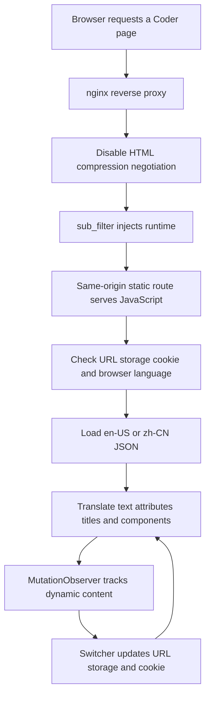

<div align="center">


Figure 1 Coder Simplified Chinese runtime overlay

<h1>Coder Simplified Chinese</h1>

<p><strong>A reversible, version-locked Chinese interface overlay that leaves the upstream Coder image unchanged</strong></p>

<p>
  <a href="README.md">简体中文</a> ·
  <a href="#quick-start">Quick install</a> ·
  <a href="#architecture">Architecture</a> ·
  <a href="#validation">Validation</a> ·
  <a href="#rollback">Rollback</a>
</p>

<p>
  
  
  
  
  
</p>

</div>

> [!IMPORTANT]
> This language pack supports only the exact Coder build pinned in the repository manifest
> The installer validates the semantic version, full build identity, and upstream commit when available before changing nginx

This README was re-audited on 2026-08-24 against `manifest.env`, the runtime, both locale catalogs, the installer, and the reproducible dry-run fixtures

## 1 Project overview

Coder is a platform for centrally delivered development workspaces
This project injects a same-origin runtime into Coder HTML through nginx, then loads a locale catalog and translates text, attributes, titles, and dynamic components in the browser
The upstream container, binary, and application directory remain untouched, so removing the managed nginx blocks and static assets rolls the overlay back [1]

<div align="center">

Table 1.1 Project position

| Dimension | Current implementation | Evidence |
| --- | --- | --- |
| Delivery | External JavaScript runtime and JSON locale catalogs | `assets/i18n/` |
| Injection | nginx `sub_filter` adds the runtime before `</head>` | `scripts/patch_nginx_conf.py` |
| Upstream changes | No Coder image, binary, or application-directory changes | `scripts/deploy.sh` |
| Locales | `en-US` and `zh-CN` with environment-based detection | `assets/i18n/coder-i18n-runtime.js` |
| Compatibility | Exact version, full build, and commit checks | `manifest.env` |
| Configuration safety | Timestamped backup and restoration on patch or reload failure | `scripts/deploy.sh` |
| License | MIT | `LICENSE` |

</div>

## 2 Interface preview

The screenshot comes from a real Coder workspace page and demonstrates localized navigation, filters, status, and workspace controls
Original user, workspace, template, and avatar identifiers were replaced with public demo values

<div align="center">


Figure 2.1 Privacy-redacted Coder Simplified Chinese workspace page

</div>

The image contains no real deployment address, account, user identifier, or workspace name

<a id="architecture"></a>

## 3 Architecture

<div align="center">



Figure 3.1 Injection, locale selection, and dynamic translation flow

</div>

<div align="center">

Table 3.1 Component responsibilities

| Component | Responsibility | Boundary |
| --- | --- | --- |
| `install.sh` | Dispatch inside a checkout or fetch an archive outside one | Archive mode requires `curl` and `tar` |
| `deploy.sh` | Detect version, locate config, install assets, back up, reload | Production install requires root |
| `patch_nginx_conf.py` | Add or replace two managed blocks | Repeated application remains idempotent |
| `coder-i18n-runtime.js` | Detect locale, load catalogs, translate, observe changes | External authentication paths are skipped |
| `zh-CN.json` | Chinese exact text, attributes, and patterns | Paired with the pinned build |
| `en-US.json` | English fallback catalog | Enables switching back to English |

</div>

## 4 Localization surface

The catalog is more than a flat glossary
It covers exact strings, placeholders, titles, accessibility labels, image alternatives, button values, and variable-bearing patterns [2]

<div align="center">

Table 4.1 Chinese catalog structure

| Type | Count | Coverage | Source |
| --- | ---: | --- | --- |
| Exact mappings | 1,220 | Titles, menus, forms, prompts, and states | `zh-CN.json` `exact` |
| Attribute mappings | 43 | `placeholder`, `title`, `aria-label`, `alt`, and `value` | `zh-CN.json` `attributes` |
| Pattern rules | 110 | Counts, time, dates, and dynamic phrases | `zh-CN.json` `patterns` |
| Catalog leaves | 1,595 | Includes metadata and pattern-object fields | JSON structure audit |
| Values containing Han characters | 1,328 | Other values are code, product names, blank fallbacks, or intentionally unchanged text | Unicode audit |

</div>

The Chinese catalog includes additional strings required by the pinned interface
This audit also replaced an instance-specific repository name with the generic workspace-repository key used by the English catalog

## 5 Locale selection

The runtime applies a fixed precedence for the initial locale
After an interactive switch, the selection is written to the URL, local storage, and a secure cookie [3]

<div align="center">

Table 5.1 Locale precedence

| Priority | Source | Example or behavior |
| ---: | --- | --- |
| 1 | URL query | `?lang=zh-CN` |
| 2 | Local storage | Default key `coder-sc.locale` |
| 3 | Cookie | Default key `coder_sc_locale` |
| 4 | Browser preferences | Chinese resolves to `zh-CN`, English to `en-US` |
| 5 | Default | `en-US` |

</div>

The cookie uses `Path=/`, `SameSite=Lax`, `Secure`, and a one-year maximum age
A custom subdomain-sharing policy may provide `window.CoderScI18nConfig.cookieDomain` before the runtime loads

## 6 Compatibility lock

<div align="center">

Table 6.1 Supported build

| Field | Pinned value | Validation |
| --- | --- | --- |
| Coder version | `2.31.6` | Exact match required |
| Full build | `v2.31.6+f765029` | Exact match when available |
| Upstream commit | `f7650296ceb9b020c79cd525ac7bd3c7f252ae1d` | Exact match when available |

</div>

The source of truth is `manifest.env`
The installer checks a running `coder/coder` container first, an explicit binary second, and the host `coder` command last
When multiple containers are detected, `--coder-container` is required to avoid targeting the wrong instance

<a id="quick-start"></a>

## 7 Quick install

### 7.1 Prerequisites

<div align="center">

Table 7.1 Environment requirements

| Requirement | Purpose |
| --- | --- |
| Pinned Coder build | Keeps DOM strings aligned with the catalog |
| nginx reverse proxy | Serves locale assets and injects the runtime |
| Bash and Python 3 | Runs deployment and config patching |
| `curl` and `tar` | Needed only for archive bootstrap mode |
| Docker or a local Coder binary | Provides the actual build identity |
| root | Writes production assets and configuration, then reloads nginx |

</div>

First, clone the repository

```bash
git clone https://github.com/AIALRA-0/Coder-Simplified-Chinese.git # Clone the public repository
cd Coder-Simplified-Chinese # Enter the language-pack directory
```

Second, validate the checkout

```bash
./scripts/validate.sh # Check JSON, JavaScript, Shell, and Python syntax
```

Third, run strict build detection and installation

```bash
sudo ./install.sh # Auto-detect one Coder container and the nginx configuration
```

Pass a generic config path when nginx auto-detection finds multiple candidates

```bash
sudo ./install.sh --nginx-conf /etc/nginx/conf.d/coder.conf # Select the reverse-proxy configuration explicitly
```

## 8 Deployment transaction

Production installation validates first, backs up second, and modifies last
Any patch, nginx validation, or reload failure restores the saved configuration [1]

<div align="center">

Table 8.1 Installation order

| Order | Action | Failure behavior |
| ---: | --- | --- |
| 1 | Parse arguments and normalize asset route | Stop immediately |
| 2 | Detect Coder version, build, and commit | Stop before mutation |
| 3 | Auto-detect or select nginx config | Stop on zero or multiple candidates |
| 4 | Install static assets | Production mode requires root |
| 5 | Write timestamped config backup | Original remains recoverable |
| 6 | Insert managed server and location blocks | Restore backup on failure |
| 7 | Run `nginx -t` and reload | Restore backup on failure |

</div>

`--dry-run` patches a temporary copy of the nginx configuration without installing assets, changing the original file, or reloading nginx

## 9 Deployment configuration

<div align="center">

Table 9.1 Defaults

| Item | Default | Override |
| --- | --- | --- |
| Install root | `/opt/coder-simplified-chinese` | `--install-root` |
| Asset route | `/__coder-sc/` | `--asset-route` |
| nginx search roots | `/etc/nginx`, `/usr/local/etc/nginx` | `CODER_SC_NGINX_SEARCH_ROOTS` |
| Archive branch | `main` | `CODER_SC_REF` |
| External archive source | No default URL | `CODER_SC_ARCHIVE_URL` or `CODER_SC_REPO_SLUG` |

</div>

Common deployment combinations

```bash
sudo ./scripts/deploy.sh --nginx-conf /etc/nginx/conf.d/coder.conf # Select an nginx config
sudo ./scripts/deploy.sh --install-root /srv/coder-simplified-chinese # Use a custom asset root
sudo ./scripts/deploy.sh --coder-container coder # Select one Coder container
sudo ./scripts/deploy.sh --skip-reload # Defer the nginx reload to the operator
./scripts/deploy.sh --dry-run --nginx-conf /etc/nginx/conf.d/coder.conf # Test only the configuration patch
```

<a id="validation"></a>

## 10 Validation

### 10.1 Base validation

```bash
./scripts/validate.sh # Validate both catalogs, runtime JavaScript, Shell, and Python syntax
```

### 10.2 Reproducible dry-run

The repository includes an nginx fixture built from a reserved domain and loopback address, plus a Coder binary stub that emits only the pinned public build identity

```bash
VALIDATE_NGINX_CONF=tests/fixtures/nginx-coder.conf VALIDATE_CODER_BINARY=tests/fixtures/coder-version-stub.sh ./scripts/validate.sh # Exercise the complete config-patch path
```

The 2026-08-24 audit passed base validation, the full dry-run, and a two-pass idempotency check that left one copy of each managed block

## 11 Resource synchronization

After updating the locale source environment, copy the runtime and both catalogs back into the repository

```bash
./scripts/sync-from-source.sh /path/to/source/i18n # Synchronize the runtime and both locale catalogs from a generic path
./scripts/validate.sh # Re-run the base validation after synchronization
```

Synchronization overwrites all three tracked targets, so review the diff, compatibility lock, and privacy fields before committing
Keep machine-specific source paths out of README files, logs, and Git history

<a id="rollback"></a>

## 12 Rollback

First, locate the timestamped nginx backup created by `deploy.sh`

Second, restore the modified nginx config from that backup

Third, run `nginx -t` and reload nginx

Fourth, remove the installed asset directory after the original Coder page is confirmed

The overlay adds only same-origin static assets and two managed nginx blocks, so rollback never touches the Coder database, container image, or workspace data

## 13 Repository map

<div align="center">

Table 13.1 Directory map

| Path | Content |
| --- | --- |
| `assets/i18n/coder-i18n-runtime.js` | Locale detection, switcher, translation, dynamic observation |
| `assets/i18n/coder-locales/en-US.json` | English catalog and fallback text |
| `assets/i18n/coder-locales/zh-CN.json` | Simplified Chinese catalog |
| `install.sh` | Checkout dispatch and archive bootstrap |
| `manifest.env` | Build lock and default paths |
| `scripts/deploy.sh` | Deployment transaction and rollback protection |
| `scripts/patch_nginx_conf.py` | Idempotent nginx config patcher |
| `scripts/validate.sh` | Syntax and dry-run validation entry point |
| `scripts/sync-from-source.sh` | Locale-resource synchronization |
| `tests/fixtures/` | Deterministic inputs without real deployment information |
| `docs/assets/readme/` | Project hero and privacy-redacted interface screenshot |

</div>

## 14 Security rules

<div align="center">

Table 14.1 Engineering boundaries

| Scope | Current boundary | Impact |
| --- | --- | --- |
| Upstream compatibility | Only the manifest-pinned build is supported | Re-sync and re-test after a Coder upgrade |
| Translation layer | Changes browser display strings, not server data | APIs, permissions, and business logic remain upstream behavior |
| Injection | Depends on nginx `sub_filter` and HTML responses | Other proxies need their own integration |
| Content Security Policy | Runtime is served from a same-origin route | Custom policies still require environment testing |
| External authentication | `/external-auth` is deliberately skipped | Sensitive authentication flows are left alone |
| Privilege | Production installation requires root | Run dry-run and inspect the patch first |
| Continuous integration | No GitHub Actions workflow is currently configured | A unified Linux validation script is included |

</div>

Public screenshots replace users, workspaces, templates, and avatar identifiers with `demo-*` values
The repository stores no real domain, account, token, password, or private deployment path
One upstream Coder help string contains an RFC1918 example subnet and must remain byte-equivalent as a runtime exact-match key; it is not deployment evidence and is documented in `docs/README-AUDIT.md`

## 15 Project governance

Translation updates should move the compatibility lock, English fallback, Chinese catalog, and reproducible validation evidence together

First, confirm that the target Coder build matches `manifest.env`

Second, synchronize resources and remove instance-specific text

Third, run base validation and the deterministic dry-run

Fourth, inspect README files, JSON, screenshots, logs, and Git differences for sensitive fields

The project is released under the [MIT License](LICENSE)

### 15.1 References

[1] AIALRA-0, “Coder Simplified Chinese Deployment Script,” `scripts/deploy.sh`, 2026

[2] AIALRA-0, “Coder Simplified Chinese Locale Catalog,” `assets/i18n/coder-locales/zh-CN.json`, 2026

[3] AIALRA-0, “Coder Simplified Chinese Runtime,” `assets/i18n/coder-i18n-runtime.js`, 2026

---

<div align="center">

If this overlay helps your team use Coder in Chinese, consider starring it, reproducing the checks, and contributing updates paired with the pinned build

</div>
