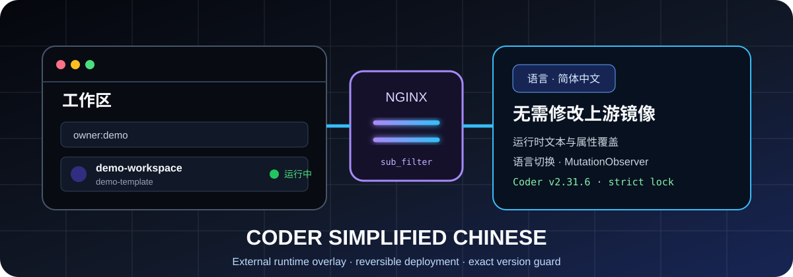
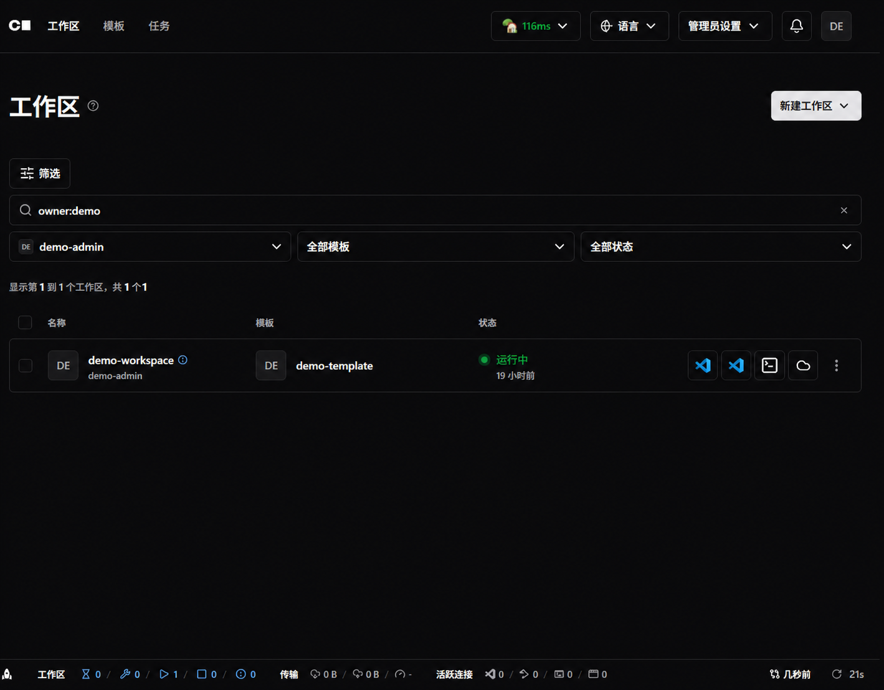
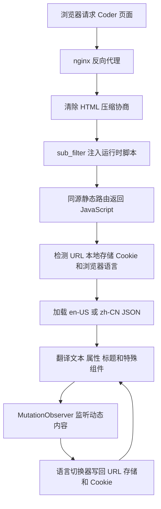

<div align="center">



图 1 Coder 简体中文运行时覆盖层

<h1>Coder 简体中文语言包</h1>

<p><strong>不改动上游镜像、可以回滚、严格锁定版本的 Coder 网页界面中文覆盖方案</strong></p>

<p>
  <a href="README.en.md">English</a> ·
  <a href="#quick-start-cn">快速安装</a> ·
  <a href="#architecture-cn">工作原理</a> ·
  <a href="#validation-cn">验证</a> ·
  <a href="#rollback-cn">回滚</a>
</p>

<p>
  
  
  
  
  
</p>

</div>

> [!IMPORTANT]
> 本语言包只支持仓库清单锁定的 Coder 构建
> 安装器会先校验版本、完整构建标识和可用的上游提交信息，再修改 nginx 配置

本文在 2026-08-24 依据 `manifest.env`、运行时脚本、两份语言目录、安装脚本和 dry-run 测试完成复核

## 1 项目概览

Coder 是用于集中提供云开发工作区的平台
本项目在 nginx 返回的 Coder HTML 中注入同源运行时脚本，再由脚本加载语言目录并翻译页面文本、属性和动态内容
整个过程保留上游容器、二进制和应用文件，撤销 nginx 配置块与静态资源即可回滚 [1]

<div align="center">

表 1.1 项目定位

| 维度 | 当前实现 | 证据 |
| --- | --- | --- |
| 交付形态 | 外部 JavaScript 运行时与 JSON 语言目录 | `assets/i18n/` |
| 注入方式 | nginx `sub_filter` 在 `</head>` 前加入脚本 | `scripts/patch_nginx_conf.py` |
| 上游改动 | 不修改 Coder 镜像、二进制或应用目录 | `scripts/deploy.sh` |
| 语言 | `en-US` 与 `zh-CN`，默认按环境自动检测 | `assets/i18n/coder-i18n-runtime.js` |
| 版本策略 | 版本、完整构建和提交信息严格匹配 | `manifest.env` |
| 配置安全 | 修改前备份，补丁或 reload 失败时恢复 | `scripts/deploy.sh` |
| 许可 | MIT | `LICENSE` |

</div>

## 2 界面预览

下图来自真实 Coder 工作区页面，中文导航、筛选、状态和工作区操作均由运行时覆盖层提供
所有原始用户、工作区、模板和头像标识已经替换为公开演示值

<div align="center">



图 2.1 脱敏后的 Coder 简体中文工作区页面

</div>

截图只展示语言包效果，不包含真实部署地址、账号、用户标识或工作区名称

<a id="architecture-cn"></a>

## 3 工作原理

<div align="center">



图 3.1 页面注入、语言选择和动态翻译流程

</div>

<div align="center">

表 3.1 组件职责

| 组件 | 职责 | 关键边界 |
| --- | --- | --- |
| `install.sh` | 仓库内转发到部署脚本，仓库外支持下载归档 | 需要 `curl` 和 `tar` |
| `deploy.sh` | 版本检测、配置定位、资源安装、备份和 reload | 正式安装需要 root |
| `patch_nginx_conf.py` | 插入或更新两个受管理配置块 | 重复执行保持单份配置块 |
| `coder-i18n-runtime.js` | 语言检测、目录加载、界面翻译和动态观察 | 不翻译外部认证路径 |
| `zh-CN.json` | 简体中文精确文本、属性和模式规则 | 与锁定构建配套 |
| `en-US.json` | 英文回退目录 | 支持界面切回英文 |

</div>

## 4 本地化覆盖面

语言目录不是简单的一张词表
它同时覆盖精确文本、输入占位符、标题、无障碍标签、图片替代文本、按钮值和带变量的模式 [2]

<div align="center">

表 4.1 中文目录结构

| 类型 | 数量 | 说明 | 数据来源 |
| --- | ---: | --- | --- |
| 精确文本映射 | 1,220 | 页面标题、菜单、表单、提示和状态 | `zh-CN.json` 的 `exact` |
| 属性映射 | 43 | `placeholder`、`title`、`aria-label`、`alt` 和 `value` | `zh-CN.json` 的 `attributes` |
| 模式规则 | 110 | 数量、时间、日期和动态句子 | `zh-CN.json` 的 `patterns` |
| 目录叶子项 | 1,595 | 包含元数据与模式对象字段 | JSON 结构复核 |
| 含中文字符的值 | 1,328 | 其余值包括代码、产品名、空回退或无需翻译的内容 | Unicode 结构复核 |

</div>

中文目录额外包含锁定界面所需的扩展文本
本轮还把一条实例专属仓库名称改为通用工作区仓库键，使中文目录与英文目录的公共键保持一致

## 5 语言选择

运行时按照固定优先级决定初始语言
用户从界面切换后，选择会同时写入地址参数、本地存储和安全 Cookie [3]

<div align="center">

表 5.1 语言检测优先级

| 优先级 | 来源 | 示例或行为 |
| ---: | --- | --- |
| 1 | URL 查询参数 | `?lang=zh-CN` |
| 2 | 浏览器本地存储 | 键名默认是 `coder-sc.locale` |
| 3 | Cookie | 键名默认是 `coder_sc_locale` |
| 4 | 浏览器首选语言 | 中文环境选择 `zh-CN`，英文环境选择 `en-US` |
| 5 | 默认值 | `en-US` |

</div>

Cookie 使用 `Path=/`、`SameSite=Lax`、`Secure` 和一年有效期
需要跨子域共享时，可以通过 `window.CoderScI18nConfig.cookieDomain` 在运行时注入前提供域配置

## 6 兼容性锁

<div align="center">

表 6.1 支持构建

| 字段 | 锁定值 | 校验方式 |
| --- | --- | --- |
| Coder 版本 | `2.31.6` | 必须精确匹配 |
| 完整构建 | `v2.31.6+f765029` | 能读取时必须精确匹配 |
| 上游提交 | `f7650296ceb9b020c79cd525ac7bd3c7f252ae1d` | 能读取时必须精确匹配 |

</div>

数据来源是 `manifest.env`
安装器优先检查正在运行的 `coder/coder` 容器，其次检查显式传入的二进制，最后尝试主机 `coder` 命令
检测到多个容器时，安装器要求使用者通过 `--coder-container` 明确选择，避免修改错误实例

<a id="quick-start-cn"></a>

## 7 快速安装

### 7.1 安装前提

<div align="center">

表 7.1 环境要求

| 要求 | 用途 |
| --- | --- |
| 锁定版本的 Coder | 保证 DOM 文本与翻译目录匹配 |
| nginx 反向代理 | 提供静态语言资源并注入运行时 |
| Bash、Python 3 | 执行部署和配置补丁 |
| `curl`、`tar` | 只在仓库外引导安装时需要 |
| Docker 或本机 Coder 二进制 | 检测实际版本 |
| root | 正式写入资源、配置和 reload |

</div>

1. 第一步，克隆仓库

```bash
git clone https://github.com/AIALRA-0/Coder-Simplified-Chinese.git # 克隆公开仓库
cd Coder-Simplified-Chinese # 进入语言包目录
```

2. 第二步，先验证仓库内容

```bash
./scripts/validate.sh # 检查 JSON、JavaScript、Shell 和 Python 语法
```

3. 第三步，执行严格版本检测和安装

```bash
sudo ./install.sh # 自动检测唯一 Coder 容器和 nginx 配置
```

nginx 存在多个候选配置时，应显式传入通用配置路径

```bash
sudo ./install.sh --nginx-conf /etc/nginx/conf.d/coder.conf # 指定实际反向代理配置
```

## 8 部署事务

正式安装按照先校验、再备份、后修改的顺序执行
任何配置补丁或 nginx 验证与 reload 失败都会触发备份恢复 [1]

<div align="center">

表 8.1 安装顺序

| 顺序 | 动作 | 失败行为 |
| ---: | --- | --- |
| 1 | 解析参数并规范静态路由 | 立即停止 |
| 2 | 检测 Coder 版本、构建和提交 | 修改前停止 |
| 3 | 自动或显式定位 nginx 配置 | 候选不唯一时停止 |
| 4 | 安装静态资源 | 正式模式要求 root |
| 5 | 写入带时间戳的配置备份 | 保留原配置 |
| 6 | 插入受管理的 server 与 location 配置块 | 失败时恢复备份 |
| 7 | 执行 `nginx -t` 和 reload | 失败时恢复备份 |

</div>

`--dry-run` 会复制 nginx 配置到临时文件并只测试补丁，不安装资源、不修改原配置、不 reload

## 9 部署配置

<div align="center">

表 9.1 默认路径

| 项目 | 默认值 | 可调方式 |
| --- | --- | --- |
| 资源根目录 | `/opt/coder-simplified-chinese` | `--install-root` |
| 资源访问前缀 | `/__coder-sc/` | `--asset-route` |
| nginx 搜索根 | `/etc/nginx`、`/usr/local/etc/nginx` | `CODER_SC_NGINX_SEARCH_ROOTS` |
| 归档分支 | `main` | `CODER_SC_REF` |
| 仓库外归档 | 无默认地址 | `CODER_SC_ARCHIVE_URL` 或 `CODER_SC_REPO_SLUG` |

</div>

常用部署组合如下

```bash
sudo ./scripts/deploy.sh --nginx-conf /etc/nginx/conf.d/coder.conf # 指定 nginx 配置
sudo ./scripts/deploy.sh --install-root /srv/coder-simplified-chinese # 改用自定义资源根目录
sudo ./scripts/deploy.sh --coder-container coder # 显式选择 Coder 容器
sudo ./scripts/deploy.sh --skip-reload # 完成修改但由使用者稍后 reload
./scripts/deploy.sh --dry-run --nginx-conf /etc/nginx/conf.d/coder.conf # 只验证配置补丁
```

<a id="validation-cn"></a>

## 10 验证

### 10.1 基础验证

```bash
./scripts/validate.sh # 校验两份 JSON、运行时 JavaScript、Shell 和 Python 语法
```

### 10.2 可复现 dry-run

仓库提供保留域名与本地回环地址构成的 nginx 固定样例，以及只输出锁定公开版本的 Coder 二进制替身

```bash
VALIDATE_NGINX_CONF=tests/fixtures/nginx-coder.conf VALIDATE_CODER_BINARY=tests/fixtures/coder-version-stub.sh ./scripts/validate.sh # 验证完整配置补丁流程
```

本轮复核结果为基础验证通过、完整 dry-run 通过、连续补丁两次后每个受管理配置块仍只有一份

## 11 资源同步

源环境中的语言目录更新后，可以把三项运行时资源同步回仓库

```bash
./scripts/sync-from-source.sh /path/to/source/i18n # 从通用源目录同步运行时和两份语言目录
./scripts/validate.sh # 同步后重新执行全部基础验证
```

同步会覆盖仓库中的三个目标文件，因此提交前应检查差异、版本锁和隐私字段
路径参数只应使用本机值，不应写入 README、日志或提交历史

<a id="rollback-cn"></a>

## 12 回滚

1. 第一步，找到 `deploy.sh` 生成的 nginx 时间戳备份

2. 第二步，用备份覆盖被修改的 nginx 配置

3. 第三步，运行 `nginx -t` 并 reload

4. 第四步，确认页面恢复后删除安装资源目录

语言包只增加同源静态资源和两段受管理配置块，因此回滚不涉及 Coder 数据库、容器镜像或工作区数据

## 13 仓库导航

<div align="center">

表 13.1 目录地图

| 路径 | 内容 |
| --- | --- |
| `assets/i18n/coder-i18n-runtime.js` | 语言检测、切换器、翻译和动态观察 |
| `assets/i18n/coder-locales/en-US.json` | 英文目录和回退文本 |
| `assets/i18n/coder-locales/zh-CN.json` | 简体中文目录 |
| `install.sh` | 仓库内转发和仓库外归档引导 |
| `manifest.env` | 版本锁与默认路径 |
| `scripts/deploy.sh` | 部署事务与回滚保护 |
| `scripts/patch_nginx_conf.py` | 幂等 nginx 配置补丁 |
| `scripts/validate.sh` | 语法与 dry-run 验证入口 |
| `scripts/sync-from-source.sh` | 语言资源同步 |
| `tests/fixtures/` | 不含真实部署信息的固定测试输入 |
| `docs/assets/readme/` | 首页横幅和脱敏界面截图 |

</div>

## 14 安全准则

<div align="center">

表 14.1 工程边界

| 范围 | 当前边界 | 影响 |
| --- | --- | --- |
| 上游兼容 | 只支持清单锁定构建 | Coder 更新后必须重新同步并复测 |
| 翻译层级 | 修改浏览器显示文本，不修改服务端数据 | API、权限和业务逻辑保持上游行为 |
| 注入方式 | 依赖 nginx `sub_filter` 和 HTML 响应 | 其他代理需要自行移植 |
| 内容安全策略 | 脚本通过同源路由提供 | 自定义策略仍需在实际环境验证 |
| 外部认证 | `/external-auth` 路径主动跳过 | 避免干扰敏感认证流程 |
| 权限 | 正式安装需要 root | 应先运行 dry-run 并审阅补丁 |
| 持续集成 | 当前未配置 GitHub Actions | 仓库提供可在 Linux 运行的统一验证脚本 |

</div>

公开截图中的用户、工作区、模板和头像标识已经替换为 `demo-*` 值
仓库不保存真实域名、账号、令牌、密码或私有部署路径
语言目录保留了一条 Coder 上游帮助文本中的 RFC1918 示例网段，因为精确源字符串是运行时匹配键，该内容不是部署事实，审计记录见 `docs/README-AUDIT.md`

## 15 项目治理

提交翻译更新时，请同时更新版本锁、英文回退目录、中文目录和可复现验证结果

1. 第一步，确认目标 Coder 构建与 `manifest.env` 一致

2. 第二步，同步资源并审阅实例专属文本

3. 第三步，运行基础验证和固定 dry-run

4. 第四步，检查 README、JSON、截图、日志和提交差异中的敏感字段

项目按 [MIT License](LICENSE) 发布

### 15.1 引用

[1] AIALRA-0, “Coder Simplified Chinese Deployment Script,” `scripts/deploy.sh`, 2026

[2] AIALRA-0, “Coder Simplified Chinese Locale Catalog,” `assets/i18n/coder-locales/zh-CN.json`, 2026

[3] AIALRA-0, “Coder Simplified Chinese Runtime,” `assets/i18n/coder-i18n-runtime.js`, 2026

---

<div align="center">

如果这个语言包帮助你在中文环境中使用 Coder，欢迎 Star、复测并提交与锁定版本配套的翻译更新

</div>
